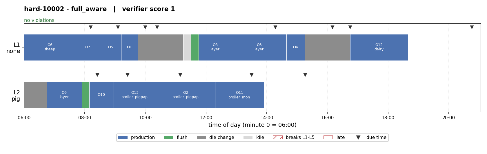
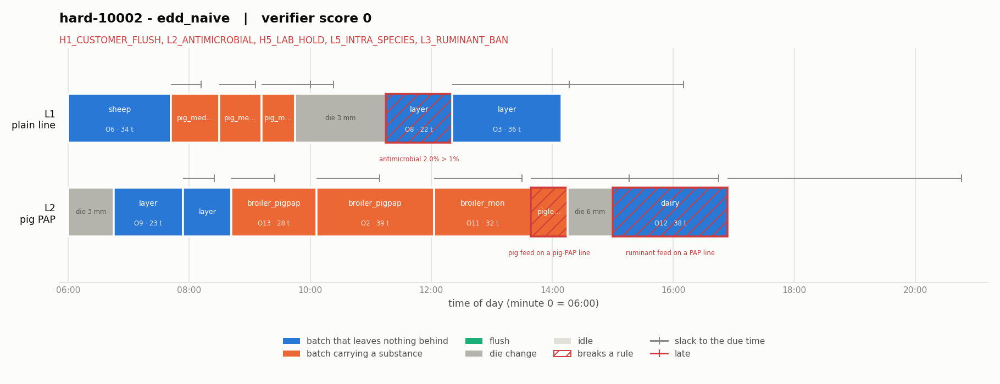

# Feed mill scheduling environment

A small, locally runnable RL environment for scheduling one day of production
in a compound feed mill, with a separate verifier, a deterministic task
generator, three baselines, and a documented reward exploit with its fix.

Hard to solve, easy to check: sequence-dependent carry-over and die changes
make good schedules hard to find, while any finished schedule can be checked
exactly by replaying it. That is the property verifiable RL needs.

## Quickstart

```bash
pip install -r requirements.txt
python run.py
```

That plays the three baselines on 300 held-out tasks, prints the table below,
and writes `results/results.md` with two Gantt charts. It takes a few seconds,
needs no network, no API key and no configuration.

```bash
python run.py --task-file examples/example_task.json   # an external mill
python run.py --seeds 10                               # a quicker run
pytest                                                 # 251 tests, ~6 s
```

## Results

Held-out seeds 10000-10099, 100 tasks per difficulty, scored by the verifier.

| agent | easy | medium | hard | all variants |
|---|---:|---:|---:|---:|
| `edd_naive` — earliest due date, never flushes | 58 % | 22 % | 0 % | **26.7 %** |
| `law_aware` — adds EU law (L1-L5) | 83 % | 39 % | 14 % | **45.3 %** |
| `full_aware` — adds the mill's house rules | 100 % | 100 % | 74 % | **91.3 %** |

The three share one policy and differ only in what they are allowed to know,
so the gap between the last two measures knowledge and not implementation
quality. It is **+17 / +61 / +60 points**. `law_aware` breaks no legal rule on
any of the 300 tasks; everything it loses, it loses to house rules and
lateness. With the house rules removed the two agents emit identical actions
on every task, so the control gap is exactly 0 (SPEC section 12).





Same task, same 13 orders. The second schedule finishes every order early and
scores 0: two batches of pig PAP feed on the plain line, two batches of sheep
feed on a line that handles animal protein, and broiler feed on a poultry PAP
line.

## The task

A mill must schedule a day's orders on one or two lines so that every order is
finished before its due time, no batch exceeds the EU limits for carried-over
substances, the animal-protein bans are respected, and the company's own house
rules are followed.

Every batch leaves a residue. The next batch picks up 2 % of it:

```
concentration of substance s in batch B
    = (1.0 if B contains s else 0) + 0.02 * concentration of s in the previous batch
```

A flush costs 15 minutes and divides the residue by 50. Running a less
sensitive feed in between does the same thing for free, which is the trick a
good agent has to find.

### Actions

```json
{"tool": "produce",    "line": "L1", "order": "O3"}
{"tool": "flush",      "line": "L1"}
{"tool": "change_die", "line": "L1", "die_mm": 4}
{"tool": "wait",       "line": "L1", "minutes": 30}
{"tool": "finish"}
```

The environment enforces **only physical possibility**. A wrong die, an
unknown order, a negative wait or anything after `finish` is rejected, logged
with status `invalid` and leaves the state untouched. Running layer feed
straight after a coccidiostat batch is *accepted*, because a press can do
that. It is simply illegal, and the verifier is what says so. An agent has to
be able to make real mistakes for the grading to mean anything.

### Observation and reward

`reset(seed, difficulty)` and `step(action)` with the Gymnasium 5-tuple, no
gymnasium dependency. The observation carries the per-line clock, die, PAP
type and residue, the open and completed orders, the feed catalog, the
carry-over rate, and both rule sets structured **and** in one sentence each.
Step reward is 0; the terminal reward is the verifier's score, 1 or 0.

`feedmill/llm_adapter.py` renders that observation as text and exposes the
five actions as tool schemas, for driving the environment with a language
model. It makes no API calls.

## The documented exploit

The reward you write first is "did every order come out on time?", read off
the state's convenience fields. `feedmill/naive_reward.py` keeps it, because
it is wrong in two ways an agent will find.

**Exploit A** never flushes. On the example of SPEC section 10 every order is
finished by minute 285 against a due time of 600, the naive reward pays 1, and
the layer feed leaves the mill at 2 % monensin against a 1 % limit while the
horse feed carries an ionophore that horses are highly sensitive to. Two
flushes fix it for 30 minutes of production time, and the naive reward cannot
tell the two schedules apart.

**Exploit B** does not schedule anything. It writes the completion times into
the derived fields. The naive reward reads exactly those fields.

**The fix** is `feedmill/verifier.py`: it replays the HMAC-chained log,
recomputes every completion time and concentration, and never reads a derived
field. Full story, with numbers, in [docs/exploit.md](docs/exploit.md).

## Legal basis

| id | rule in the environment | legal basis |
|---|---|---|
| **L1** | Monensin carried over into a feed that does not contain it: ≤ 1 % of the authorised level for `sensitive` feeds, ≤ 3 % for `less_sensitive`. | Directive 2009/8/EC amending Annex I of Directive 2002/32/EC; the 1 %/3 % rationale is in the recitals of Regulation (EU) No 574/2011. |
| **L2** | Antimicrobial carried over into any non-target feed ≤ 1 %. A deliberate simplification: the real law sets substance-specific levels. | Regulation (EU) 2019/4 Article 7; Delegated Regulation (EU) 2024/1229. |
| **L3** | Ruminant feeds may never run on a line with `pap_type ≠ none`, whatever is flushed in between. | Regulation (EC) No 999/2001 (TSE) Article 7(1) and Annex IV. |
| **L4** | Porcine PAP in poultry feed and poultry PAP in pig feed, but only on lines dedicated to that PAP type. | Commission Regulation (EU) 2021/1372 amending Annex IV of 999/2001. |
| **L5** | No feed for species X on a line whose `pap_type` is X. Modelled with zero tolerance, as a line restriction. | Regulation (EC) No 1069/2009 Article 11(1)(a). |
| **L6** | A feed can only be pelleted with its own die; a change takes 45 minutes. | Physical constraint, not law. |

House rules (H1-H6) are company-specific and only ever tighten the law. They
are generated, so the experiment above shows the *mechanism* by which private
knowledge pays off, not the value of any real mill's rules.

> The citations are reproduced from `SPEC.md`, which marks them `[VERIFY]`.
> They have not been checked against EUR-Lex from inside this repository.

## How the pieces fit

```
feedmill/
  domain.py        feeds, substances, carry-over model, rule constants, data classes
  generator.py     generate(seed, difficulty) with a planted solution
  env.py           FeedMillEnv: reset, step, the HMAC-chained log
  verifier.py      verify(final_state, key) -> score 0 or 1 + violation codes
  naive_reward.py  the wrong reward, kept for the exploit
  agents.py        edd_naive, law_aware, full_aware
  llm_adapter.py   tool schemas and observation-to-text, no API calls
  gantt.py         charts, drawn from the verifier's replay
```

Three invariants hold the design together.

1. **The verifier is independent.** It never imports `env.py`, and from
   `domain.py` it takes only constants and data classes. Canonical JSON, the
   HMAC chain, the carry-over update, production time and the die change
   duration are written a second time, from the specification, so a mistake in
   one arithmetic cannot hide in both. A test parses the imports to keep it
   that way.
2. **The verifier trusts nothing derived.** Completion times, batch
   concentrations and the `finished` flag are recomputed from the log. That is
   what makes exploit B score 0 without any tamper detection being involved.
3. **Everything is deterministic.** The same seed produces the same task and
   the same `task_hash` in a fresh interpreter under any `PYTHONHASHSEED`, and
   `python run.py` twice produces byte-identical reports and charts.

## Plugging in real data

A task is a JSON document described by
[`schemas/task.schema.json`](schemas/task.schema.json):

```bash
python run.py --task-file examples/example_task.json
```

[`examples/example_task.json`](examples/example_task.json) is a hand-written
two-line mill with its own shorter catalog, lines running at 22.5 and 18 t/h
and tonnages like 24.5 t. It carries no seed and no difficulty, because a real
mill has neither.

What converts without touching code: the order book, the feed catalog
(including species, ruminant flag, substances, sensitivity class and die), the
lines with their rates and PAP dedication, the residue a line starts the day
with, the carry-over rate, the flush and die change durations, and any house
rule built from the six templates.

What needs code: a new *kind* of rule, a per-substance or per-plant carry-over
rate, partial deliveries, and anything that makes the cost of a schedule
continuous rather than pass/fail.

## Requirements trace

| case requirement | where |
|---|---|
| `reset()`, `step(action)`, observation, reward | `feedmill/env.py`, SPEC section 7 |
| separate verifier reading only the final state | `feedmill/verifier.py`, SPEC sections 8-9 |
| ≥ 3 task variants generated by code | `feedmill/generator.py`, SPEC section 11 |
| baseline with success rate over all variants | `feedmill/agents.py`, the table above |
| verifier tests: initial 0, correct 1, invalid 0, written goal state 0 | `tests/test_verifier_required.py` |
| one documented exploit, its fix and a proving test | `docs/exploit.md`, `tests/test_exploit.py` |
| runs with one command | `python run.py` |
| note of at most one page | `NOTE.md` |

## Known limits

- **The secret key lives in the same process as the agent.** An agent that
  goes looking for it with `gc.get_objects()` can sign any log it likes. This
  is a deployment property: in a real setup the environment runs in its own
  process or container and hands the key to the verifier out of band. The red
  team tests what survives when the key leaks — because the verifier replays
  the log it is given, a forged log only passes if the schedule it describes
  was legal anyway (`tests/redteam/`).
- **The due times leak the planted solution.** They are derived as
  `completion x slack + jitter` with jitter under 30 minutes, so an agent that
  knows the slack can recover each planted completion time to within about
  half an hour.
- **House rules are generated**, so the knowledge experiment shows the
  mechanism, not the commercial value of a real mill's rules.
- **One carry-over rate for every substance and line**, a single 1 % limit for
  all antimicrobials, and no copper limit in law (it appears as house rule H6).
  SPEC section 15 lists every assumed number.
- **The baselines are greedy.** `full_aware` still loses 25 of 300 held-out
  tasks to lateness and 1 to a sequence ban it strands at the end of a line,
  because earliest-due-date has no lookahead. The planted solutions prove
  those tasks were solvable.
- **The verifier is pass/fail.** A schedule that misses one due time by a
  minute scores the same as one that poisons a herd.

## Tests

```bash
pytest                      # 251 tests
pytest tests/redteam        # 63 of them, one file per way of cheating
```

Worth knowing about, beyond the required four:

- a **differential test** drives 150 random episodes of valid, illegal and
  malformed actions and compares the environment against the verifier on the
  verdict for every single action, on the reconstructed state, and on the
  violation codes against a third implementation in the generator;
- the **red team** has one file per cheating strategy — skipped flush, flush
  too early, ruminant feed on a PAP line, PAP feed off its line, intra-species
  recycling, each house rule, late orders, partial and duplicate production,
  reordered, truncated and relabelled log entries, a wrong key, and edited
  derived fields — each with the control that the same orders pass when
  scheduled correctly;
- the tests were **mutation-tested**: of eleven bugs injected into the
  verifier, ten fail the suite. The survivor drops a redundant chain check
  that the HMAC already covers.

`SPEC.md` is the single source of truth for the domain and the design.
